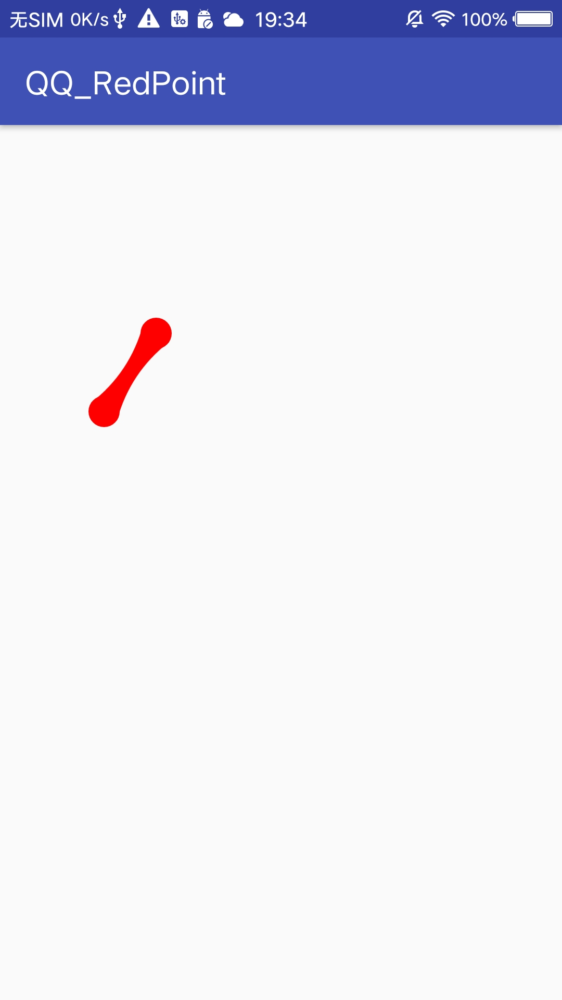

## 一、前言
用QQ的时候，发现未读消息拖拽效果蛮有意思，就模仿了一下。
## 二、效果图
具体效果如下：


效果图具有以下特性：
* 小圆点拖拽是有范围的
* 在拖拽范围进行拖拽后释放小圆点会进行回弹后回到初始位置
* 拖拽的时候，中心的圆会慢慢变小，拖拽的圆大小不变，中间连接的部分越来越长并且越来细，直至消失
* 如果超出定义的拖拽范围后进行释放会有爆炸的效果并且消失

## 三、分析
### 1.组成
先分析这个视图的组成：
* 中心的小圆：一个固定的圆
* 跟着手指移动的小圆：一个拖拽的圆
* 两个圆的连接部分
* 两条直线(两个圆的直径)，用来连接两条贝塞尔曲线，形成封闭图形

### 2.绘制
* 中心的小圆和拖拽的小圆
绘制小圆相对比较简单，直接调用`canvas.drawCircle`即可，定点中心圆的圆心是固定的，拖拽圆的圆形是手指触摸屏幕的坐标。
* 两个圆之间连接的部分
中间连接的部分其实是两条二阶贝塞尔曲线，具体分析如下：


那么(p1-p3)这条线可以用以下伪码来绘制：
```java
Path rPathLeft = new Path();
rPathLeft.moveTo(P1.x,P1.y);
rPathLeft.quadTo(M.x,M.y,P3.x,P3.y);
```
同理(P2-P4)这条线可以用以下伪代码来绘制:
```java
Path rPathRight = new Path();
rPathRight.moveTo(P2.x,P2.y);
rPathRight.quadTo(M.x,M.y,P4.x,P4.y);
```
* 两条直线
两条直线就是分别是(P1-P2)和(P3-P4)
```java
rPathLeft.lineTo(P4.x,P4.y)
rPathRight.lineTo(P2.x,P2.y)
```

绘制以上两条贝塞尔曲线和直线需要五个点：P1,P2,P3,P4,M,其中P1,P2,P3,P4是圆的切点，现在只知道两个圆的中心圆点O1和O2,那么怎么根据这两个点来求其余四个圆的切点呢？先分析：


根据上图可得知：

tan(a) = y / x

a = arctan(y / x)

P3.x = X1-r2*sina

P3.y = Y1-r2*cosa

P1.x = X0-r1*sina

P1.y = X0-r1*cosa

同理P2,P4也可以求出。

#### 2.1.静态实现
下面先静态实现绘制图像，直接继承帧布局(FrameLayout)
```java
public class RedPointView extends FrameLayout{
    //画笔
    private Paint rPaint,tPaint;
    //半径
    private int rRadius;
    //固定圆的圆心
    PointF tCenterPointF = new PointF(300,400);
    //拖拽圆的圆心
    PointF tDragPointF = new PointF(200,550);
    //固定圆的半径
    private float tCenterRadius = 30;
    //拖拽圆的半径
    private float tDragRadius = 30;
    //线条
    private Path rPath;

    //一个参数的构造函数,调用两个参数的构造函数
    public RedPointView(Context context) {
        this(context,null);
    }
    //两个参数的构造函数,调用三个参数的构造函数
    public RedPointView(Context context, @Nullable AttributeSet attrs) {
        this(context, attrs,0);
    }
    //三个参数的构造函数
    public RedPointView(Context context, @Nullable AttributeSet attrs, int defStyleAttr) {
        super(context, attrs, defStyleAttr);
        init();
    }
    //初始化小圆
    private void init(){
        //初始化Paint对象
        rPaint = new Paint();
        //设置颜色 红色
        rPaint.setColor(Color.RED);
        //设置抗锯齿
        rPaint.setAntiAlias(true);
        //设置填充
        rPaint.setStyle(Paint.Style.FILL);

        tPaint = new Paint();
        //设置颜色 红色
        tPaint.setColor(Color.RED);
        //设置抗锯齿
        tPaint.setAntiAlias(true);
        //半径 25
        rRadius = 25;
    }

    //绘制自己孩子方法
    //ViewGroup上绘制东西的时候往往重写的是dispatchDraw()方法而不是onDraw()方法
    protected void dispatchDraw(Canvas canvas){
        super.dispatchDraw(canvas);

        //先绘制固定圆
        canvas.drawCircle(tCenterPointF.x,tCenterPointF.y,tCenterRadius,rPaint);
        //再绘制拖拽圆
        canvas.drawCircle(tDragPointF.x,tDragPointF.y,tDragRadius,rPaint);

        float x = tCenterPointF.x - tDragPointF.x;
        float y = tDragPointF.y - tCenterPointF.y;
        //求a的角度
        double a = Math.atan(y / x);

        //中心圆的p1 x坐标偏移
        float offsetX1 = (float) (tCenterRadius * Math.sin(a));
        float offsetY1= (float) (tCenterRadius * Math.cos(a));

        //拖拽圆的p2 x坐标偏移
        float offsetX2 = (float) (tDragRadius * Math.sin(a));
        float offsetY2= (float) (tDragRadius * Math.cos(a));

        //p1的坐标
        float p1_x = tCenterPointF.x - offsetX1;
        float p1_y = tCenterPointF.y - offsetY1;


        //p2的坐标
        float p2_x = tCenterPointF.x + offsetX1;
        float p2_y = tCenterPointF.y + offsetY1;
        
        //p3的坐标
        float p3_x = tDragPointF.x - offsetX2;
        float p3_y = tDragPointF.y - offsetY2;

        //p4的坐标
        float p4_x = tDragPointF.x + offsetX2;
        float p4_y = tDragPointF.y + offsetY2;
        //控制点M的坐标
        float controll_x = (tCenterPointF.x + tDragPointF.x) / 2;
        float controll_y = (tDragPointF.y + tCenterPointF.y) / 2;
        //创建Path来绘制路径
        rPath = new Path();
        //绘制路径方向:P1->P3->P4->P1
        rPath.reset();
        rPath.moveTo(p1_x,p1_y);
        rPath.quadTo(controll_x,controll_y,p3_x,p3_y);
        rPath.lineTo(p4_x,p4_y);
        rPath.quadTo(controll_x,controll_y,p2_x,p2_y);
        rPath.lineTo(p1_x,p1_y);
        rPath.close();
        canvas.drawPath(rPath,tPaint);

    }

}
```
布局文件直接`ConstraintLayout`嵌套这个自定义View即可：
```java
<android.support.constraint.ConstraintLayout
    xmlns:android="http://schemas.android.com/apk/res/android"
    xmlns:app="http://schemas.android.com/apk/res-auto"
    xmlns:tools="http://schemas.android.com/tools"
    android:layout_width="match_parent"
    android:layout_height="match_parent"
    tools:context="com.knight.qq_redpoint.MainActivity">

    <com.knight.qq_redpoint.RedPointView
        android:layout_width="match_parent"
        android:layout_height="match_parent"
        app:layout_constraintTop_toTopOf="parent"
        app:layout_constraintBottom_toBottomOf="parent"
        app:layout_constraintLeft_toLeftOf="parent"
        app:layout_constraintRight_toRightOf="parent"/>

</android.support.constraint.ConstraintLayout>
```
效果图如下：



#### 2.2.动态实现
静态效果绘制出来了，那么继续往下走，实现动态效果，实现动态无非是拖拽圆的切点和贝塞尔曲线的控制点在变化，而拖拽圆的圆心其实是触摸屏幕的坐标，那么其切点和控制点根据上一个步骤的公式来求出，下面直接在触摸方法`onTouchEvent`来处理：
```java
    public boolean onTouchEvent(MotionEvent event){
        switch (event.getAction()){
            case MotionEvent.ACTION_DOWN:
                //event.getRawX:表示的是触摸点距离屏幕左边界的距离 
                //event.getRawY:表示的是触摸点距离屏幕上边界的距离
                //event.getX()取相对于你触摸的view的左边的偏移(X坐标)
                //event.getY()取相对于你触摸的view的顶边的偏移(Y坐标)
                float originalDragX = event.getX();
                float originalDragy = event.getY();
                updateDragPoint(originalDragX,originalDragy);
                break;
            case MotionEvent.ACTION_MOVE:
                float overDragX = event.getX();
                float overDragy = event.getY();
                //移动的时候不断更新拖拽圆的位置
                updateDragPoint(overDragX,overDragy);
                break;
        }
        return true;

    }
    
        //更新拖拽圆的圆心坐标
    private void updateDragPoint(float x,float y){
        tDragPointF.set(x,y);
        postInvalidate();

    }
```
效果图如下：


##### 2.2.1 中心圆半径变化
仔细观察效果，发现随着拖拽距离的增加，中心圆的半径是越来越小的
好像有那么一点点感觉了，但是远远还不够。那么我们可以定一个规则，拖拽距离和中心圆之间的关系,并且设置拖拽最大距离：
```java
    //中心的最小半径
    private float minRadius = 8;
    //默认拖拽最大距离
    private float maxDistance = 160；

    //计算拖动过程中中心圆的半径
    private float changeCenterRadius() {
        float mDistance_x = tDragPointF.x - tCenterPointF.x;
        float mDistance_y = tDragPointF.y - tCenterPointF.y;
        //两个圆之间的距离
        float mDistance = (float) Math.sqrt(Math.pow(mDistance_x, 2) + Math.pow(mDistance_y, 2));
        //计算中心圆的半径 这里用拖拽圆默认的半径去减距离变化的长度（这里可以自己定义变化的半径）
        float r = tDragRadius - minRadius * (mDistance / maxDistance);
        //计算出半径如果小于最小的半径 就赋值最小半径
        if (r < minRadius) {
            r = minRadius;
        }
        return r;


    }


```
最后在`onDraw`方法里，添加计算变化中心圆的半径即可：
```java
    //绘制方法
    protected void onDraw(Canvas canvas) {
        super.onDraw(canvas);
        canvas.save();
        //绘制固定中心圆
        tCenterRadius = changeCenterRadius();
        canvas.drawCircle(tCenterPointF.x, tCenterPointF.y, tCenterRadius, rPaint);
        ....
    }
```
效果图如下：


##### 2.2.2 距离限制
下面增加拖拽距离限制，当拖拽距离大于给定的距离时，中心圆就会消失，逻辑很简单，也就是在`onTouchEvent`里的`ACTION_MOVE`，计算两个圆的拖拽距离，如果超出给定的拖拽距离，就不绘制贝塞尔曲线和中心固定圆：
```java
    //标识 拖拽距离是否大于规定的拖拽范围
    private boolean isOut;

    //标识 如果超出拖拽范围
    private boolean isOverStep;
    //绘制方法
    protected void onDraw(Canvas canvas) {
        super.onDraw(canvas);
        canvas.save();

        if(!isOut){
            //绘制固定中心圆
            tCenterRadius = changeCenterRadius();
            canvas.drawCircle(tCenterPointF.x, tCenterPointF.y, tCenterRadius, rPaint);
            .....
        }
        //一旦超出给定的拖拽距离 就绘制拖拽圆
        if(!isOverStep){
            canvas.drawCircle(tDragPointF.x,tDragPointF.y,tDragRadius,rPaint);
        }
    }
    
    //重写onTouchEvent方法
    public boolean onTouchEvent(MotionEvent event) {
        switch (event.getAction()) {
            ........
            case MotionEvent.ACTION_MOVE:
                float overDragX = event.getX();
                float overDragy = event.getY();
                //移动的时候不断更新拖拽圆的位置
                updateDragPoint(overDragX, overDragy);
                float tDragDistance = getDistanceTwo(tCenterPointF,tDragPointF);
                //判断如果拖拽距离大于给定距离时
                if(tDragDistance > maxDistance){
                    isOut = true;
                }else{
                    //这里要注意 不能赋值isOut为false 因为一旦超出给定的拖拽距离就没办法恢复了
                    isOverStep = false;
                }
                break;
        }
        return true;

    }
    
    //计算两个圆之间的距离
    private float getDistanceTwo(PointF tCenterPointF,PointF tDragPointF){
        return (float) Math.sqrt(Math.pow(tCenterPointF.x - tDragPointF.x,2) + Math.pow(tCenterPointF.y - tDragPointF.y,2));
    }

```
效果图如下：


上面只做了超出拖拽范围的效果，下面添加没有超出拖拽范围效果，松开手后拖拽圆会回弹原来的位置，那就要在`MotionEvent.ACTION_UP`做处理：
```java
    //重写onTouchEvent方法
    public boolean onTouchEvent(MotionEvent event) {
        switch (event.getAction()) {
            ....
            case MotionEvent.ACTION_UP:
                getDistanceTwo(tCenterPointF,tDragPointF);
                //这里要判断
                if(!isOut){
                    //没有超出
                    kickBack();
                }
                postInvalidate();
                break;
        }
        return true;

    }
    
   /**
     * 拖拽圆回弹动画
     *
     */
    private void kickBack() {
        final PointF initPoint = new PointF(tDragPointF.x,
                tDragPointF.y);
        final PointF finishPoint = new PointF(tCenterPointF.x,
                tCenterPointF.y);
        //值从0平滑过渡1
        ValueAnimator animator = ValueAnimator.ofFloat(0.0f,1.0f);
        animator.addUpdateListener(new ValueAnimator.AnimatorUpdateListener() {

            @Override
            public void onAnimationUpdate(ValueAnimator animation) {
                //获取动画执行进度
                float rFraction = animation.getAnimatedFraction();
                //更新拖拽圆的圆心
                PointF updateDragPoint = getPoint(
                        initPoint, finishPoint, rFraction);
                updateDragPoint(updateDragPoint.x, updateDragPoint.y);
            }
        });
        //设置动画插值器
        animator.setInterpolator(new OvershootInterpolator(3.0f));
        //动画时间
        animator.setDuration(500);
        animator.start();
    }


    /**
     *
     * 根据百分比获取两点之间的某个点坐标
     * @param initPoint 初识圆
     * @param finishPoint 最终圆
     * @param percent 百分比
     * @return
     * 
     */
    public PointF getPoint(PointF initPoint, PointF finishPoint, float percent) {
        return new PointF(getValue(initPoint.x , finishPoint.x,percent), getValue(initPoint.y , finishPoint.y,percent));
    }

    /**
     * 获取分度值
     * @param start
     * @param finish
     * @param fraction
     * @return
     */
    public float getValue(Number start, Number finish,float fraction){
        return start.floatValue() + (finish.floatValue() - start.floatValue()) * fraction;
    }
```
效果图：


##### 2.2.3 增加爆炸效果
当拖拽圆超出拖拽范围后，会有一个爆炸效果后并消失，下面添加爆炸效果：
```java
    //初始化爆炸图片
    private int[] explodeImgae = new int[]{
        R.mipmap.explode_1,
        R.mipmap.explode_2,
        R.mipmap.explode_3,
        R.mipmap.explode_4,
        R.mipmap.explode_5
    };
    //爆炸ImageView
    private ImageView explodeImage;
```
并在`init`初始化方法里添加对这爆炸图像：
```java
        //添加爆炸图像
        explodeImage = new ImageView(getContext());
        //设置布局参数
        LayoutParams lp = new LayoutParams(ViewGroup.LayoutParams.WRAP_CONTENT,ViewGroup.LayoutParams.WRAP_CONTENT);
        explodeImage.setLayoutParams(lp);
        explodeImage.setImageResource(R.mipmap.explode_1);
        //一开始不显示
        explodeImage.setVisibility(View.INVISIBLE);
        //增加到viewGroup中
        addView(explodeImage);
```
并实现播放动画方法：
```java
    /**
     *
     * 超过拖拽范围外显示爆炸效果
     *
     */
    private void showExplodeImage(){
        //属性动画
        ValueAnimator animator = ValueAnimator.ofInt(0,explodeImgaes.length - 1);
        animator.addUpdateListener(new ValueAnimator.AnimatorUpdateListener() {
            @Override
            public void onAnimationUpdate(ValueAnimator animation) {
                //不断更新图像变化
                explodeImage.setBackgroundResource(explodeImgaes[(int) animation.getAnimatedValue()]);
            }
        });
        //为动画添加监听
        animator.addListener(new AnimatorListenerAdapter() {
            @Override
            public void onAnimationCancel(Animator animation) {
                super.onAnimationCancel(animation);
            }

            @Override
            public void onAnimationEnd(Animator animation) {
                super.onAnimationEnd(animation);
                //结束了 把图像设置不可见状态
                explodeImage.setVisibility(View.GONE);
            }

            @Override
            public void onAnimationRepeat(Animator animation) {
                super.onAnimationRepeat(animation);
            }

            @Override
            public void onAnimationStart(Animator animation) {
                super.onAnimationStart(animation);
                //开始时 设置为可见
                explodeImage.setVisibility(View.VISIBLE);
            }

            @Override
            public void onAnimationPause(Animator animation) {
                super.onAnimationPause(animation);
            }

            @Override
            public void onAnimationResume(Animator animation) {
                super.onAnimationResume(animation);
            }
        });
        //时间
        animator.setDuration(600);
        //播放一次
        animator.setRepeatMode(ValueAnimator.RESTART);
        //差值器
        animator.setInterpolator(new OvershootInterpolator());
        animator.start();
    }

```
在`MotionEvent.ACTION_UP`里：
```java
            case MotionEvent.ACTION_UP:
                getDistanceTwo(tCenterPointF,tDragPointF);
                //这里要判断
                if(!isOut){
                    //没有超出
                    kickBack();
                }
                if(isOut){
                    //抬起标识
                    isOverandUp = true;
                    //让爆炸图片在原点中央
                    explodeImage.setX(event.getX() - tDragRadius);
                    explodeImage.setY(event.getY() - tDragRadius);
                    //如果中心圆和拖拽圆大于拖拽距离 就播放爆炸
                    if(getDistanceTwo(tCenterPointF,tDragPointF) > maxDistance){
                        showExplodeImage();
                    }
                    //这里是如果拖拽圆和中心圆距离已经超出拖拽距离 然后又把拖拽圆移动与中心圆大于30 还是会爆炸
                    if(getDistanceTwo(tCenterPointF,tDragPointF) >=30){
                        showExplodeImage();
                    }

                }
                postInvalidate();
                break;
```
在`dispatchView`超出拖拽距离到小于恢复中心圆的距离逻辑：
```java
        if(isOut){
            //如果一开始超出拖拽范围 后面又移动拖拽圆与中心圆的距离少于30，就恢复中心圆位置
            if(getDistanceTwo(tCenterPointF,tDragPointF) < 30 && isOverandUp){
                canvas.drawCircle(tCenterPointF.x, tCenterPointF.y, tCenterRadius, rPaint);
                isOut = false;
                isOverandUp = false;
            }


        }


        //一旦超出给定的拖拽距离 就绘制拖拽圆
        if(!isOverStep){
            //如果超出并且抬起
            if(!isOverandUp && isOut){
                canvas.drawCircle(tDragPointF.x,tDragPointF.y,tDragRadius,rPaint);
            }

        }
```
效果图如下：

.gif)

.gif)

## 四、添加到ListView
### 1.添加到WindowManager
上面所实现的效果还远远不够，怎么像QQ那样，在ListView或者Recycleview里小圆点能自由在屏幕内拖拽呢？因为view只能在它的父控件内绘制，所以也只能在自己的列表内移动，那怎么能在全屏拖拽呢？只能借助WindowManager，也就是当将要拖拽的圆点添加到windowManager，并且设置触摸监听，自定义拖拽view从继承`ViewGroup`变为继承`View`:
```java
   public class BetterRedPointView extends View{ 

    //WindowManager 对象
    private WindowManager windowManager;
    //拖拽view的宽
    private int dragViewWidth;
    //拖拽view的高
    private int dragViewHeight;
    //WindowManager 布局参数
    private WindowManager.LayoutParams params;
    //状态监听
    private DragViewStatusListener dragViewStatusListener;
    //布局参数
    params = new WindowManager.LayoutParams();
    //背景透明
    params.format = PixelFormat.TRANSLUCENT;
    params.height = WindowManager.LayoutParams.WRAP_CONTENT;
    params.width = WindowManager.LayoutParams.WRAP_CONTENT;
    //以左上角为基准
    params.gravity = Gravity.TOP | Gravity.LEFT;
    
}
```
构造函数将拖拽的`view`和`WindowManager`对象传进来,并初始化一些参数：
```java
    //构造函数
    public BetterRedPointView(Context context, View dragView, WindowManager windowManager){
        super(context);
        this.context = context;
        this.dragView = dragView;
        this.windowManager = windowManager;
        init();

    }
    
   //初始化小圆
    private void init() {
        //手动测量
        dragView.measure(1,1);
        dragViewWidth = dragView.getMeasuredWidth() / 2;
        dragViewHeight = dragView.getMeasuredHeight() / 2;

        tDragRadius = dragViewHeight;
        //中心圆的半径
        tCenterRadius = SystemUtil.dp2px(context,8);
        //最大拖拽距离
        maxDistance = SystemUtil.dp2px(context,80);
        //最小半径
        minRadius = SystemUtil.dp2px(context,3);

        //布局参数
        params = new WindowManager.LayoutParams();
        //背景透明
        params.format = PixelFormat.TRANSLUCENT;
        params.height = WindowManager.LayoutParams.WRAP_CONTENT;
        params.width = WindowManager.LayoutParams.WRAP_CONTENT;
        //以左上角为基准
        params.gravity = Gravity.TOP | Gravity.LEFT;

    }
```

### 2.更新拖拽view的位置
在上面例子中更新拖拽圆`updateDragPoint`的方法，也同样通过`WindowManager.updateViewLayout`来更新拖拽`view`的的位置：
```java
    /**
     * 更新拖拽圆心坐标
     * @param x
     * @param y
     */
    private void updateDragPoint(float x, float y) {
        tDragPointF.set(x, y);
        changeManagerView(x,y);
        postInvalidate();

    }
    
    /**
     * 重新绘制拖拽圆的布局
     * @param x x坐标
     * @param y y坐标
     */
    private void changeManagerView(float x,float y){
        params.x = (int)(x - dragViewWidth);
        params.y = (int)(y - dragViewHeight - statusBarHeight);
        windowManager.updateViewLayout(dragView,params);
    }
```

### 3.添加状态监听
增加拖拽圆和中心圆的拖拽情况监听：
```java
public interface DragViewStatusListener {

    /**
     * 在拖拽范围外移动
     *
     * @param dragPoint
     */
    void outDragMove(PointF dragPoint);

    /**
     * 在拖拽范围外移动
     * 产生爆炸效果
     *
     */
    void outDragMoveUp(PointF dragPoint);

    /**
     * 在拖拽范围内移动
     *
     * @param dragPoint
     */
    void inDragUp(PointF dragPoint);


    /**
     * 当移出拖拽范围 后拖拽到范围内 恢复中心圆
     *
     */
    void recoverCenterPoint(PointF centerPoint);


}

```
在对应触发的情况下实现监听回调,如爆炸的动画：
```java
            case MotionEvent.ACTION_UP:
                getDistanceTwo(tCenterPointF,tDragPointF);
                //这里要判断
                if(!isOut){
                    //没有超出
                    kickBack();
                }
                if(isOut){
                    //抬起标识
                    isOverandUp = true;
                    //让爆炸图片在原点中央
                    //explodeImage.setX(event.getX() - tDragRadius);
                    //explodeImage.setY(event.getY() - tDragRadius);
                    //如果中心圆和拖拽圆大于拖拽距离 就播放爆炸
                    if(getDistanceTwo(tCenterPointF,tDragPointF) > maxDistance){
                        //这里监听做爆炸效果
                        if(dragViewStatusListener != null){
                             dragViewStatusListener.outDragMoveUp(tDragPointF);
                        }
                    }
                    //这里是如果拖拽圆和中心圆距离已经超出拖拽距离 然后又把拖拽圆移动与中心圆大于30 还是会爆炸
                    if(getDistanceTwo(tCenterPointF,tDragPointF) >=30){
                        if(dragViewStatusListener != null){
                           dragViewStatusListener.outDragMoveUp(tDragPointF);
                        }
                    }
                }
```

### 4.新建中间桥梁
新建一个类，主要用来辅助，主要用来创建拖拽自定义`view`和创建`WindowManager`对象初始化数据，并且作出各种情况下(在范围内拖拽，范围外拖拽)的逻辑和爆炸逻辑,主要代码如下：
```java
public class BetterRedPointViewControl implements View.OnTouchListener,DragViewStatusListener{


    //上下文
    private Context context;
    //拖拽布局的id
    private int mDragViewId;
    //WindowManager 对象
    private WindowManager windowManager;
    //布局参数
    private WindowManager.LayoutParams params;

    private BetterRedPointView betterRedPointView;
    //被拖拽的View
    private View dragView;
    //要显示的View
    private View showView;

    //状态栏高度
    private int statusHeight;
    //最大拖拽距离
    private float maxDistance = 560;
    //中心圆的半径
    private float tCenterRadius = 30;
    //小圆最小半径
    private float minRadius = 8;

    
    //构造函数
    public BetterRedPointViewControl(Context context,View showView,int mDragViewId,DragStatusListener dragStatusListener){
        this.context = context;
        this.showView = showView;
        this.mDragViewId = mDragViewId;
        this.dragStatusListener = dragStatusListener;
        //设置监听 执行自己的触摸事件
        showView.setOnTouchListener(this);
        params = new WindowManager.LayoutParams();
        params.format = PixelFormat.TRANSLUCENT;

    }
    @Override
    public boolean onTouch(View v, MotionEvent event) {
        int action = MotionEventCompat.getActionMasked(event);
        if(action == MotionEvent.ACTION_DOWN){

            ViewParent parent = v.getParent();
            if(parent == null){
                return false;
            }

            parent.requestDisallowInterceptTouchEvent(true);
            statusHeight = SystemUtil.getStatusBarHeight(showView);
            showView.setVisibility(View.INVISIBLE);
            dragView = LayoutInflater.from(context).inflate(mDragViewId,null,false);
            //获取文本内容
            getText();
            windowManager = (WindowManager)context.getSystemService(Context.WINDOW_SERVICE);
            //每当触摸的时候就创建拖拽的小圆
            betterRedPointView = new BetterRedPointView(context,dragView,windowManager);
            //初始化数据
            init();
            //设置监听回调
            betterRedPointView.setDragViewStatusListener(this);
            //添加到窗体进行显示
            windowManager.addView(betterRedPointView,params);
            windowManager.addView(dragView,params);

        }
        betterRedPointView.onTouchEvent(event);
        return true;
    }

    @Override
    public void outDragMove(PointF dragPoint) {

    }

    @Override
    public void outDragMoveUp(PointF dragPoint) {
      removeView();
      showExplodeImage(dragPoint);
      dragStatusListener.outScope();
    }

    @Override
    public void inDragUp(PointF dragPoint) {
      removeView();
      dragStatusListener.inScope();
    }

    @Override
    public void recoverCenterPoint(PointF centerPoint) {
      removeView();
      dragStatusListener.inScope();
    }


    /**
     * 初始化数据
     *
     */
    private void init(){
        //计算小圆在屏幕中的坐标
        int[] points = new int[2];
        showView.getLocationInWindow(points);
        int x = points[0] + showView.getWidth() / 2;
        int y = points[1] + showView.getHeight() / 2;
        betterRedPointView.setStatusBarHeight(statusHeight);
//        betterRedPointView.setMaxDistance(maxDistance);
//        betterRedPointView.setCenterRadius(tCenterRadius);
//        betterRedPointView.setMinRadius(minRadius);
        betterRedPointView.setCenterDragPoint(x,y);
    }
    /**
     * 获取文本内容
     *
     */
    private void getText(){
        if(showView instanceof TextView && dragView instanceof TextView){
            ((TextView)dragView).setText((((TextView) showView).getText().toString()));

        }
    }

    /**
     *  移出view对象
     *
     */
    private void removeView(){
        if (windowManager != null && betterRedPointView.getParent() != null && dragView.getParent() != null) {
            windowManager.removeView(betterRedPointView);
            windowManager.removeView(dragView);
        }
    }
}
```
### 5.调用
在Recycleview内执行调用即可：
```java
public class RecycleviewAdapter extends RecyclerView.Adapter<ItemHolder> {
    /**
     * 需要删除的view的position 用于更新rv操作
     */
    ArrayList<Integer> needRemoveList =new ArrayList<Integer>();

    private Context mContext;
    public RecycleviewAdapter(Context mContext){
        this.mContext = mContext;
    }


    @NonNull
    @Override
    public ItemHolder onCreateViewHolder(@NonNull ViewGroup viewGroup, int i) {
        //加载布局文件
        View itemView = LayoutInflater.from(mContext).inflate(R.layout.item,null);
        return new ItemHolder(itemView);
    }

    @Override
    public void onBindViewHolder(@NonNull ItemHolder itemHolder, final int i) {
        itemHolder.tv_dragView.setText(String.valueOf(i));

        Glide.with(mContext).load(R.mipmap.iv_image).apply(RequestOptions.bitmapTransform(new CircleCrop()).override(200,200)).into(itemHolder.iv_head);
        //是否隐藏要拖拽的view
        if(needRemoveList.contains(i)){
            itemHolder.tv_dragView.setVisibility(View.GONE);
        }
        else {
            itemHolder.tv_dragView.setVisibility(View.VISIBLE);
            itemHolder.tv_dragView.setText(String.valueOf(i));
        }
        //一个是拖拽的view 一个是拖拽的view布局
        new BetterRedPointViewControl(mContext, itemHolder.tv_dragView, R.layout.includeview, new BetterRedPointViewControl.DragStatusListener() {
            /**
             * 在范围内
             * 
             */
            @Override
            public void inScope() {
                notifyDataSetChanged();
            }

            /**
             * 在范围外
             * 
             */
            @Override
            public void outScope() {
                needRemoveList.add(i);
                notifyDataSetChanged();

            }
        });
    }

    @Override
    public int getItemCount() {
        return 100;
    }
}
```
### 6.最终效果
效果图如下：


